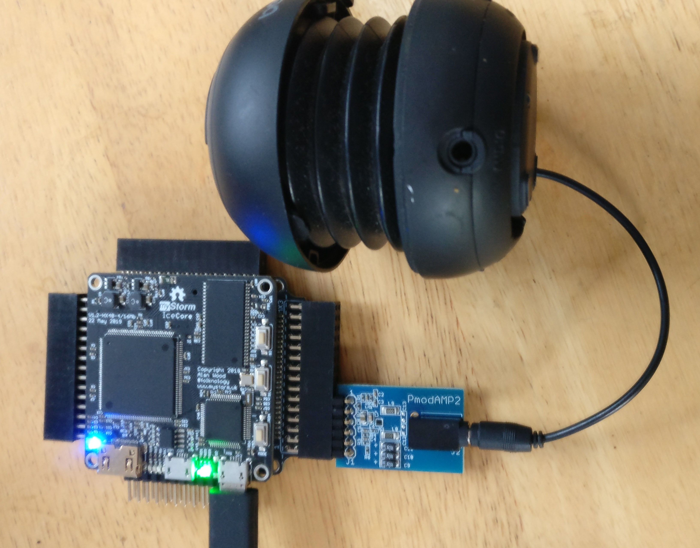

# Audio

## 1-bit DACs

You can play audio on any FPGA output pin by sending a pulse width modulated (PWM) signal to it. A PWM signal has a frequency and a duty cycle.

There are also PWM implementations in [Simon Monk’s Programming FPGAs][] book and on the [fpga4fun site][].

There is a more detailed article on it on the [ZipCPU blog][] using the [Digilent PmodAmp2](https://reference.digilentinc.com/reference/pmod/pmodamp2/start). That Pmod has one pin for the audio output, but has two extra pins to specific gain and shutdown. See more details below.

The PWM signal can be sent to one channel of a speaker just by connecting the pin to an audio jack through a resistor or a low-pass filter. The low pass filter smooths the PWM signal, but that is optional for high impedance speakers.

![PWM Audio][img1]

[Simon Monk’s Programming FPGAs]:		https://github.com/lawrie/prog_fpgas/tree/master/blackice/ch07_pwm/src
[fpga4fun site]:				https://www.fpga4fun.com/PWM_DAC.html
[img1]:						./PWMAudio.jpg "PWM Audio"
[ZipCPU blog]:					http://zipcpu.com/blog/2019/04/24/pl-pmodamp2.html

## Tone generation

The fpga4fun site has a [very simple example of tone generation][].

[very simple example of tone generation]:	https://www.fpga4fun.com/MusicBox1.html

Create a directory call music, and add:

music.pcf:

```
set_io speaker 26
set_io clk 60
```

It uses pin 26 (on Mixmod 3) to connect to a speaker directly (if impedance is high), via a resistor, or via a low pass filter. There is information on this on the fpga4fun site.

This is the Verilog code for the musical note A above middle C using the BlackIce Mx 25hz clock:

music.v:

```verilog
module music(clk, speaker);
	input clk;
	output speaker;
	parameter clkdivider = 25000000/440/2;

	reg [16:0] counter;
	always @(posedge clk) if(counter==0) counter <= clkdivider-1; else counter <= counter-1;

	reg speaker;
	always @(posedge clk) if(counter==0) speaker <= ~speaker;

endmodule
```

Run that in the normal way and you should hear an A4 note.

To run that using the Digilent PmodAmp2 in the top row of Mixmod3, closest to the USB connector, change the pcf file to:

music.pcf:

```
set_io speaker 21
set_io gain 22
set_io shutdown 26

set_io clk 60
```

and change the Verilog to:

music.v:

```verilog
module music(clk, speaker, gain, shutdown);
	input clk;
	output speaker, gain, shutdown;
	parameter clkdivider = 25000000/440/2;
	
	assign gain = 0;
	assign shutdown = 1;

	reg [16:0] counter;
	always @(posedge clk) if(counter==0) counter <= clkdivider-1; else counter <= counter-1;

	reg speaker;
	always @(posedge clk) if(counter==0) speaker <= ~speaker;

endmodule
```



The fpga4fun.com site describes how to do more [interesting sounds][] like police sirens. [Here][here1] are [here][here2] are the BlackIce Mx version of those sound generators.

[interesting sounds]:					https://www.fpga4fun.com/MusicBox2.html
[here1]:						../examples/audio/music2
[here2]:						../examples/audio/music2a

## Playing tunes

The fpga4fun site goes on to give an [example of playing tunes][]. Here is a [BlackIce Mx version][] of that.

[example of playing tunes]:				https://www.fpga4fun.com/MusicBox4.html
[BlackIce Mx version]:					https://github.com/lawrie/blackicemxbook/tree/master/examples/audio/music4

## Audio streaming over a UART

The fpga4fun site has an example of audio streaming MP3 data coming from a UART connection.  The code works unchanged on Blackice Mx. We just need to set up a pcf file use the standard Makefile.

Create a directory called audiostream and add:

stream.pcf:

```
set_io PWM_out 26
set_io RxD 61
set_io clk 60
```

PWM.v

```verilog
module PWM(input clk, input RxD, output PWM_out);
	wire RxD_data_ready;
	wire [7:0] RxD_data;
	async_receiver deserializer(.clk(clk), .RxD(RxD), .RxD_data_ready(RxD_data_ready), .RxD_data(RxD_data)); 

	reg [7:0] RxD_data_reg;
	always @(posedge clk) if(RxD_data_ready) RxD_data_reg <= RxD_data;
	////////////////////////////////////////////////////////////////////////////
	reg [8:0] PWM_accumulator;
	always @(posedge clk) PWM_accumulator <= PWM_accumulator[7:0] + RxD_data_reg;

	assign PWM_out = PWM_accumulator[8];
endmodule
```
Get the async_receiver.v and BaudTickGen.v files from fpga4fun.com.

Makefile:

```make
VERILOG_FILES = PWM.v async_receiver.v BaudTickGen.v
PCF_FILE = stream.pcf

include ../blackicemx.mk
```

To stream audio over uart, you need a suitable streaming client. On Linux, you can install mpg123.

`mpg123 -m -s -4 --8bit <filename>.mp3 >/dev/ttyACM0`

## I2S

To get better sound quality you can use the [Digilent i2s Pmod][].

![I2S Audio][img2]

This requires a higher bandwidth music stream than uart can handle. You could read the mp3 file from the SD card reader, or you could stream data over QSPI from the STM32 or over SPI from a Raspberry Pi using the RPi header. See the chapter on the RPi header for how to do that.

[Digilent i2s Pmod]:					https://store.digilentinc.com/pmod-i2s-stereo-audio-output/
[img2]:							./I2SAudio.jpg "I2S Audio"

## Microphones

To record speech or other audio input, you need a microphone.

There is the [Digilent MIC3 MEMS Microphone Pmod][].

![Microphone Pmod][img3]

Here is [an example][] of using the microphone to stream audio to the i2s Pmod. The example needs some work on it to get the timing right.

[Digilent MIC3 MEMS Microphone Pmod]:	https://store.digilentinc.com/pmod-mic3-mems-microphone-with-adjustable-gain/
[img3]:					https://cdn10.bigcommerce.com/s-7gavg/products/385/images/3862/Pmod_MIC3__04127.1456866882.1280.1280.png?c=2
[an example]:				https://github.com/lawrie/verilog_examples/tree/master/fpgafun/microphone
