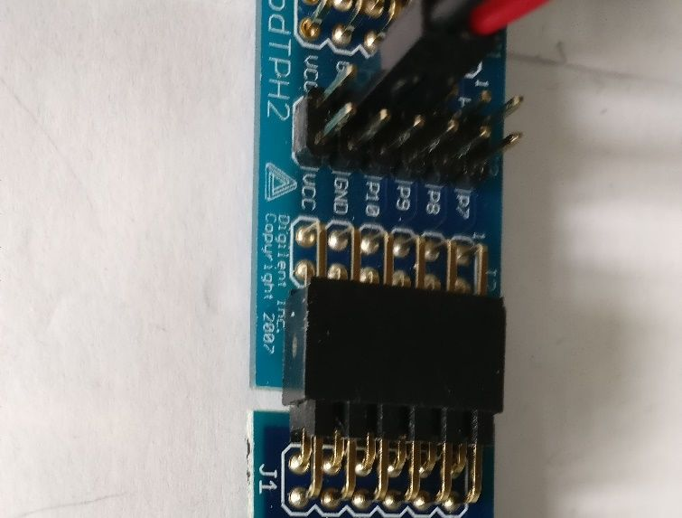

# Debugging

There are various techniques for debugging Verilog applications on the BlackIce II. If you wish to check that the correct signals are being generated or the correct signals received, you can connect an oscilloscope or logic analyser to Pmod or other outputs.

You can get a lot of bugs out of modules by writing test beds for them and running them in a simulator, as described in the next chapter.

The best method is not to have to debug at all. You can use formal methods to prove that your code is correct, but that is outside the scope of this book.

## Test points

Digilent test point Pmods are useful for this as they let you connect wires to any of the input or output pins while providing a passthrough to the real hardware.

## LEDS

One of the simplest techniques for debugging is to use LEDs to show the value of individual pins or bits, or to use a bank of LEDs to show multi-bit items.

7-segment LEDS can display such data in a more readable format, either in decimal of hex.

## UART Debugging

The UART is useful for sending debugging messages to. [Here][] is an example of a debug module being used to show the key codes coming from a PS/2 keyboard.

[Here]:									https://github.com/lawrie/verilog_examples/tree/master/fpga/debug
