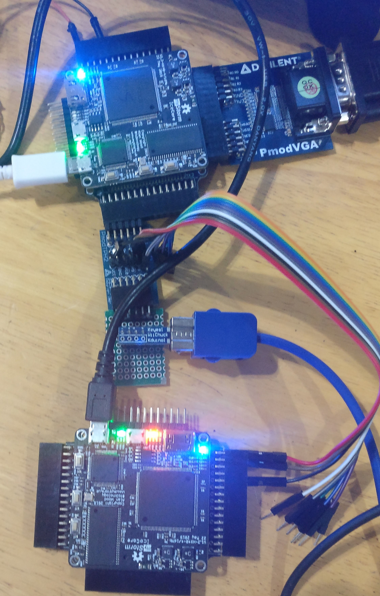
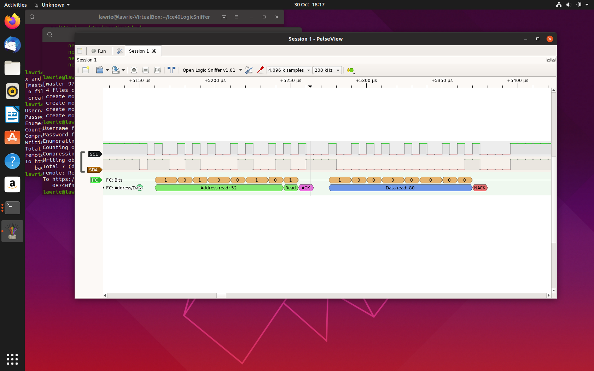

|                        |                        |                        |
|------------------------|------------------------|------------------------|
|[Prev](../Analog2Digital/Analog2Digital.html)|[Up](..) |[Next](../SpinalHDL/SpinalHDL.html)|

# Logic Analysers

The BlackIce Mx can act as a logic analyser without any extra hardware, although a Test point Pmod or MixMod is useful if you want to analyse the signals to and from a device connected to a Pmod or MixMod. In that way one Blackice Mx can analyse the logic of another Blackice Mx driving a peripheral.

One logic analyser application that is available on BlackIce Mx is [Ice40LogicSniffer][1], the OpenBench Logic Sniffer (OLS) ported to BlackIce by David Banks (@hoglet67). This can be built for BlackIce or BlackIce Mx by running the build.sh script in the blackicemx or the blackice directory.

[1]:									https://github.com/lawrie/Ice40LogicSniffer

OLS uses a variant of the Sump protocol. There are various OLS clients that can be used including <https://lxtreme.nl/projects/ols/>.

Here it is analysing the data from a key press via a test point Pmod connected to a Digilent PS/2 Pmod.

There are other clients such as PulseView, which is part of the Sigrok project. It has extra protocol decoders.
Here it is decoding the I2C protocol:

Another Logic Analyser that could be port to Blackice boards is [SUMP2](https://github.com/blackmesalabs/sump2) by Kevin Hubbard of [BlackMesaLabs](https://blackmesalabs.wordpress.com/). It uses run length encoding to enable more data to be sent between the FPGA and the client, and it has its own python client. There are [ports of it](https://github.com/ironsteel/sump2-olimex-fpga) to other ice40 boards.

|                        |                        |                        |
|------------------------|------------------------|------------------------|
|[Prev](../Analog2Digital/Analog2Digital.html)|[Up](..) |[Next](../SpinalHDL/SpinalHDL.html)|
