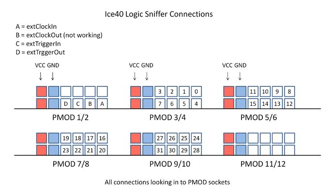
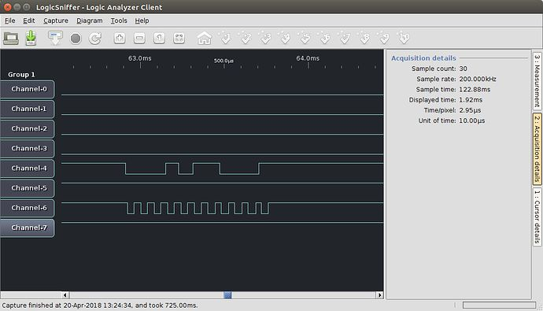
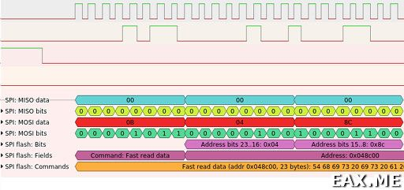

# Logic Analysers

The BlackIce II can act as a logic analyser without any extra hardware, although a Test point Pmod is useful if you want to analyse the signals to and from a device connected to a Pmod.

One logic analyser application that is available on BlackIce II is [Ice40LogicSniffer][1], the OpenBench Logic Sniffer (OLS) ported to BlackIce by David Banks (@hoglet67). This can be built for BlackIce or BlackIce II by running the build.sh script in the blackice directory.

[1]:									https://github.com/hoglet67/Ice40LogicSniffer

OLS uses a variant of the Sump protocol. There are various OLS clients that can be used including <https://lxtreme.nl/projects/ols/>.

Here it is analysing the data from a key press via a test point Pmod connected to a Digilent PS/2 Pmod.

There are other clients such as PulseView, which is part of the Sigrok project. It has extra protocol decoders.
Here it is decoding the SPI protocol:

