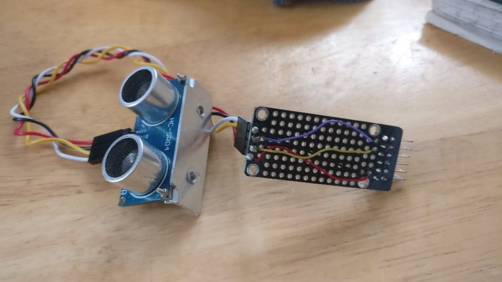
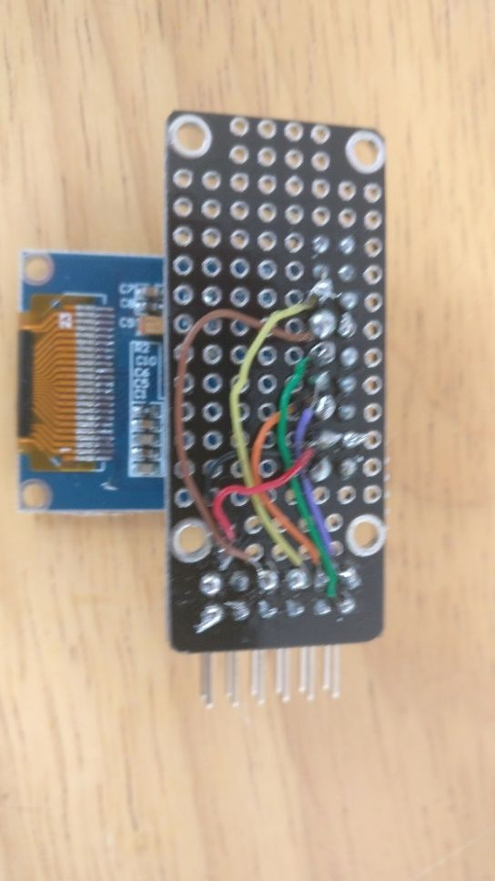

# Making Pmods

The [myStorm Hackers PMOD kit][1] is available on Tindie and can be used to build PMODs for BlackIce.

PMODs for cheap hardware modules available on ebay and elsewhere are easy to make. Soldering female headers to the proto board allows modules to be plugged into the protoboard and can allow them to be used for multiple similar modules, such as a variety of i2c or SPI modules. Wire-wrapping wire works well for making the connections between the headers.

When you are happy with a PMOD, you can get a PCB made for it, by for example, using KiCad and the OSH Park service.

[1]:									https://www.tindie.com/products/Folknology/the-mystorm-hackers-pmod-kit/

