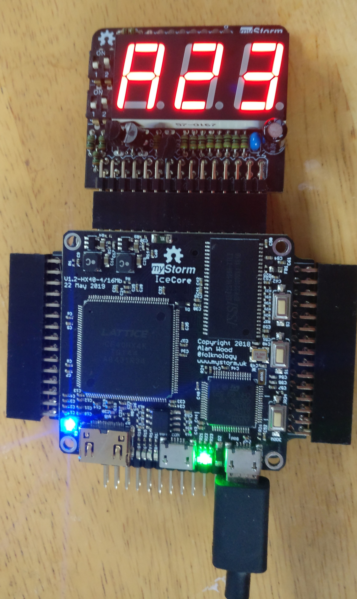

# Output Devices

## LEDs

If you need more LEDs than the 4 built-in ones, you can buy an LED Pmod. The [Digilent Pmod8LD][] has 8 leds, or you can make your own. An 8-LED Pmod is useful for simple diagnostics, displaying the value of a byte as a bit pattern.

[Digilent Pmod8LD]:		https://store.digilentinc.com/pmod-8ld-eight-high-brightness-leds/

![LEDs][img1]

[img1]:				./LEDs.jpg "LEDs"

Here is an example with the Pmod connected to Pmod 3 / 4.

Make a directory called leds8 and add:

leds.pcf

```
set_io clk 60

set_io leds[0] 34
set_io leds[1] 33
set_io leds[2] 29
set_io leds[3] 28
set_io leds[4] 38
set_io leds[5] 37
set_io leds[6] 32
set_io leds[7] 31
```

leds.v

```verilog
module leds(
  input clk,
  output reg [7:0] leds
);

  reg [19:0] counter;
  
  always @(posedge clk) begin
    counter <= counter + 1;
    if (counter == 0) leds <= leds + 1;
  end
 
endmodule
```

Makefile

```make
VERILOG_FILES = leds.v 
PCF_FILE = leds.pcf

include ../blackicemx.mk
```

## RGB LEDs

![RGB LEDs][img2]

RGB LEDS have three connections for red, green and blue, and can display combination of those colours, such as cyan, tallow and magenta.

A simple program to set the RGB according to three slider switches is as follows.
Connect an RGB LED to pins 1, 2 and 3 of Pmod 11 (top row). A breadboard adapter from the myStorm Pmod hackers kit can be used to do this. You need resistors on each of the RGB pins to limit the current.

[img2]:									./RGBLEDs.jpg "RGB LEDs"

Create a directory called rgbled and add:

rgbled.pcf:

```
set_io rgb[0] 34
set_io rgb[1] 33
set_io rgb[2] 29
	
set_io switch[0] 142
set_io switch[1] 141
set_io switch[2] 136
```

rgbled.v:

```verilog
module rgbled(
	input [2:0] switch,
	output [2:0] rgb
);
	
	assign rgb = switch;
	
endmodule
```

Makefile:

```make
VERILOG_FILES = rgbled.v
PCF_FILE = rgbled.pcf

include ../blackicemx.mk
```

You can then use the first three dip switches on the board to set the colour of the RGB LED.

## Seven segment displays

### 3-digit MixMod

The myStorm 7-segment MixMod has three digits with optional decimal points. It also has 4 dip switches and an optional header for reading some digital and analog signals from the MixMod.



Seven segment displays are useful for diagnostics and as a simple user interface. They can display decimal or hex numbers.

Seven segment displays usually have a pin for each segment and another for the dot that optionally separates digits. The digits themselves are usually multiplexed, with a selector pin for each digit. Each digit must be selected, and its segments activated about one thousand times a second.

This example  displays three hex digits, the first of which is the bit pattern from the switches:

This example 

The hex27seg.v module converts a hex digit to the output pins to set the relevant segments:

```verilog
module h27seg (
    input wire [3:0] hex,
    output reg [6:0] s7
    );

    always @(*)
        case (hex)
            // Segments - gfedcba
            4'h0: s7 = 7'b1000000;
            4'h1: s7 = 7'b1111001;
            4'h2: s7 = 7'b0100100;
            4'h3: s7 = 7'b0110000;
            4'h4: s7 = 7'b0011001;
            4'h5: s7 = 7'b0010010;
            4'h6: s7 = 7'b0000010;
            4'h7: s7 = 7'b1111000;
            4'h8: s7 = 7'b0000000;
            4'h9: s7 = 7'b0010000;
            4'hA: s7 = 7'b0001000;
            4'hB: s7 = 7'b0000011;
            4'hC: s7 = 7'b1000110;
            4'hD: s7 = 7'b0100001;
            4'hE: s7 = 7'b0000110;
            4'hF: s7 = 7'b0001110;
            default: s7 = 7'b1111111;
        endcase 

endmodule
```

The 7seg_display.v module periodically displays each digit before they fade:

```verilog
module seven_seg_display (
	input clk, 
	output reg [2:0] ca, 
	);

	initial begin
		ca = 3'b110;
	end

	reg [17:0] count;

	always @(posedge clk) begin
    	count <= count + 1;
		if(count[17]) begin
			count <= 0;
			ca <= {ca[1:0], ca[2]};
		end
	end
	
endmodule
```

And here is the top level 7seg.v module:

```verilog
module chip(
  input clk,
  output [2:0] ca,
  output [7:0] seg,
  input  [3:0] d
);

 wire [11:0] val = 'h123;
 wire [3:0] dig = (ca == 'b011 ? d : ca == 'b101 ? val[7:4] : val[3:0]);
 assign seg[7] = 1;

 h27seg hex (
   .hex(dig),
   .s7(seg[6:0])
 );

 seven_seg_display seg7 (
   .clk(clk),
   .ca(ca)
 );

endmodule
```

7seg_display.pcf:

```
set_io clk 60

#set_io led[0] 49 # B81/GBin5 L0 Blue led / S2 button
#set_io led[1] 52 # B82/GBin4 L1 Green led / S1 button
#set_io led[2] 55 # B91 L3 Yellow led
#set_io led[3] 56 # B94 cs Red led

set_io seg[0] 3  # a
set_io seg[1] 4  # b
set_io seg[2] 144  # c
set_io seg[3] 143  # d
set_io seg[4] 1  # e
set_io seg[5] 8  # f
set_io seg[6] 7  # g
set_io seg[7] 2  # dp

set_io ca[0] 135  # ca0
set_io ca[1] 139 # ca1
set_io ca[2] 138  # ca2

set_io d[0] 142
set_io d[1] 141
set_io d[2] 136
set_io d[3] 137
```

and the Makefile:

```make
VERILOG_FILES = 7seg.v 7seg_display.v hex27seg.v
PCF_FILE = 7seg_display.pcf

include ../blackicemx.mk
```

### 2-Digit Digilent Pmod

Digilent make the [PmodSSD][], a two-digit 7-segment display Pmod.

This can be driven in a simlar way, except that there are just two digits, no decimal points and a single pin is used to select which digit to display.

[PmodSSD]:								https://store.digilentinc.com/pmod-ssd-seven-segment-display/

## VGA output

![VGA Output][img7]

Driving a VGA monitor required a Pmod such as the [Digilent PmodVGA][]. It uses 4-bits for each of the red, green and blue colours.

We will concentrate on supporting the standard 640 x 480 pixel resolution, but it is possible to support higher frequencies.

A clock for 640 x 480 VGA can be produced in a few different ways. Using a pre-scaler to divide the 100 Mhz clock by 3 to produce a 33.3Mhz clock works, but is slightly out of spec. Using a pre-scaler to produce a 25Mhz clock works, but not all VGA monitors support that frequency. Using a PLL to produce a 31.5 Mhz clock is the most accurate way.

We will use the pong example from the fpgafun web site to demonstrate VGA output. The only change to the code from the fpgafun.com is the addition of the 31.5Mhz clock using a PLL. This means that we are not using the full 4-bit VGA output. Instead we map the single R, G and B signals used by the code to the pin corresponding to the most significant bit of the 4-bits used by the Digilent Pmod.

This example needs a Digilent VGA Pmod in Pmods 7/8/9/10 and a rotary encoder for moving the paddle in Pmod3, pins 1 and 2 (top row). Rotary sensors are explained in the Sensors chapter below.

[img7]:									./VGAOutput.jpg "VGA Output"
[Digilent PmodVGA]:						https://store.digilentinc.com/pmod-vga-video-graphics-array/

Make a directory called pong, and add:

pong.v
```verilog
// Pong VGA game
// (c) fpga4fun.com

module pong(clk25, vga_h_sync, vga_v_sync, vga_R, vga_G, vga_B, quadA, quadB);
input clk125;
output vga_h_sync, vga_v_sync, vga_R, vga_G, vga_B;
input quadA, quadB;

wire inDisplayArea;
wire [9:0] CounterX;
wire [8:0] CounterY;
wire clk = clk25;

hvsync_generator syncgen(.clk(clk), .vga_h_sync(vga_h_sync), .vga_v_sync(vga_v_sync), 
	.inDisplayArea(inDisplayArea), .CounterX(CounterX), .CounterY(CounterY));

/////////////////////////////////////////////////////////////////
reg [8:0] PaddlePosition;
reg [2:0] quadAr, quadBr;
always @(posedge clk) quadAr <= {quadAr[1:0], quadA};
always @(posedge clk) quadBr <= {quadBr[1:0], quadB};

always @(posedge clk)
if(quadAr[2] ^ quadAr[1] ^ quadBr[2] ^ quadBr[1])
begin
	if(quadAr[2] ^ quadBr[1])
	begin
		if(~&PaddlePosition)        // make sure the value doesn't overflow
			PaddlePosition <= PaddlePosition + 1;
	end
	else
	begin
		if(|PaddlePosition)        // make sure the value doesn't underflow
			PaddlePosition <= PaddlePosition - 1;
	end
end

/////////////////////////////////////////////////////////////////
reg [9:0] ballX;
reg [8:0] ballY;
reg ball_inX, ball_inY;

always @(posedge clk)
if(ball_inX==0) ball_inX <= (CounterX==ballX) & ball_inY; else ball_inX <= !(CounterX==ballX+16);

always @(posedge clk)
if(ball_inY==0) ball_inY <= (CounterY==ballY); else ball_inY <= !(CounterY==ballY+16);

wire ball = ball_inX & ball_inY;

/////////////////////////////////////////////////////////////////
wire border = (CounterX[9:3]==0) || (CounterX[9:3]==79) || (CounterY[8:3]==0) || (CounterY[8:3]==59);
wire paddle = (CounterX>=PaddlePosition+8) && (CounterX<=PaddlePosition+120) && (CounterY[8:4]==27);
wire BouncingObject = border | paddle; // active if the border or paddle is redrawing itself

reg ResetCollision;
always @(posedge clk) ResetCollision <= (CounterY==500) & (CounterX==0);  // active only once for every video frame

reg CollisionX1, CollisionX2, CollisionY1, CollisionY2;
always @(posedge clk) if(ResetCollision) CollisionX1<=0; else if(BouncingObject & (CounterX==ballX   ) & (CounterY==ballY+ 8)) CollisionX1<=1;
always @(posedge clk) if(ResetCollision) CollisionX2<=0; else if(BouncingObject & (CounterX==ballX+16) & (CounterY==ballY+ 8)) CollisionX2<=1;
always @(posedge clk) if(ResetCollision) CollisionY1<=0; else if(BouncingObject & (CounterX==ballX+ 8) & (CounterY==ballY   )) CollisionY1<=1;
always @(posedge clk) if(ResetCollision) CollisionY2<=0; else if(BouncingObject & (CounterX==ballX+ 8) & (CounterY==ballY+16)) CollisionY2<=1;

/////////////////////////////////////////////////////////////////
wire UpdateBallPosition = ResetCollision;  // update the ball position at the same time that we reset the collision detectors

reg ball_dirX, ball_dirY;
always @(posedge clk)
if(UpdateBallPosition)
begin
	if(~(CollisionX1 & CollisionX2))        // if collision on both X-sides, don't move in the X direction
	begin
		ballX <= ballX + (ball_dirX ? -1 : 1);
		if(CollisionX2) ball_dirX <= 1; else if(CollisionX1) ball_dirX <= 0;
	end

	if(~(CollisionY1 & CollisionY2))        // if collision on both Y-sides, don't move in the Y direction
	begin
		ballY <= ballY + (ball_dirY ? -1 : 1);
		if(CollisionY2) ball_dirY <= 1; else if(CollisionY1) ball_dirY <= 0;
	end
end 

/////////////////////////////////////////////////////////////////
wire R = BouncingObject | ball | (CounterX[3] ^ CounterY[3]);
wire G = BouncingObject | ball;
wire B = BouncingObject | ball;

reg vga_R, vga_G, vga_B;
always @(posedge clk)
begin
	vga_R <= R & inDisplayArea;
	vga_G <= G & inDisplayArea;
	vga_B <= B & inDisplayArea;
end

endmodule
```

Get [hvsync_generator.v][] from the fpga.fun site.

[hvsync_generator.v]:					https://www.fpga4fun.com/files/hvsync_generator.zip

pong.pcf

```
set_io   clk25       60
set_io   vga_h_sync  1
set_io   vga_v_sync  2
set_io   vga_R       139
set_io   vga_G       4
set_io   vga_B       135
set_io   quadA       21
set_io   quadB       22
```

And a Makefile:

```make
VERILOG_FILES = pong.v hsync_generator.v
PCF_FILE = pong.pcf

include ../blackicemx.mk
```

Use the rotary encoder to move the paddle.

## Neopixels

![Neopixels][img9]

WS2811, WS2812 and WS2812B neopixel strips use PWM signals over a single wire to switch and set the colour of each pixel in a strip. Longer strips need a separate power supply.

Here is [an example][] of driving a short 8 neopixel strip.

[img9]:				./NeoPixels.jpg "Neopixels"
[an example]:			https://github.com/lawrie/verilog_examples/tree/master/fpga/ws2812b

## LCD Displays

### LCD Text Displays

#### Parallel-connected text LCDs

![Parallel Connected Text LCD][img14]

The [fpgafun site][] shows how to drive these displays, and [here][] is the example, modified to run on the BlackIce Mx. You can send command to it from the command line e.g.

`echo -n -e “\x00\x01” >/dev/ttyACM0`

to reset it.

[img14]:			./ParallelConnectedTextLCD.jpg "Parallel Connected Text LCD"
[fpgafun site]:			https://www.fpga4fun.com/TextLCDmodule.html
[here]:				https://github.com/lawrie/verilog_examples/blob/master/fpgafun/textlcd/
