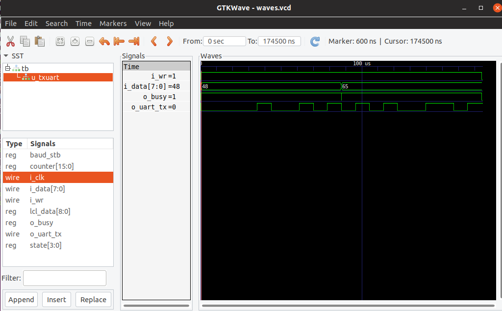

|                        |                        |                        |
|------------------------|------------------------|------------------------|
|[Prev](../Debugging/Debugging.html)|[Up](..) |[Next](../Audio/Audio.html)|

# Simulation

Simulation is a useful technique to verify and debug your Verilog designs.

There are two common open source tools that are used for simulation: Icarus Verilog (iverilog) and Verilator.

With Icarus Verilog you write a test bench for the component that you want to test in System Verilog. System Verilog has many features for testing that are not synthesizable and connot be used in standard Verilog.

Verilator is a more powerful tool that generates C++ from your Verilog code. You normally write a testbench in C++ to test your Verilog modules, and do not usually need to write a System Verilog testbench. Verilator has interactive and graphical simulators for a lot of components.

## Icarus Verilog

We will write a testbench for the [txuart](https://github.com/folknology/IceCore/blob/USB-CDC-issue-3/Examples/line-echo/txuart.v)  module in the [line-echo](https://github.com/folknology/IceCore/tree/USB-CDC-issue-3/Examples/line-echo) IceCore example.

This testbench uses the uart transmitter to send two characters "H" and "e" and to write a .vcd file that can then be looked at with gtkwave to check that the waveform on the output pin is correct.

Here is the testbench, [tb.v](https://github.com/lawrie/blackicemxbook/blob/master/examples/sim/tb.v):

```
timescale 1ns/100ps

module tb();
        initial begin
                $dumpfile("waves.vcd");
                $dumpvars(0);
        end

        reg clk;

        initial begin
                clk = 1'b0;
        end

        always begin
                #20 clk = !clk;
        end

        reg       i_wr;
        wire      o_busy;
        reg [7:0] i_data;
        wire      o_uart_tx;

        txuart #(.CLOCKS_PER_BAUD(217)) u_txuart (
                .i_clk (clk),
                .i_wr(i_wr),
                .i_data(i_data),
                .o_busy(o_busy),
                .o_uart_tx(o_uart_tx)
        );

        initial begin
                i_wr            = 1'b0;
                repeat(10) @(posedge clk);

                @(posedge clk);
                i_wr            = 1'b1;
                i_data          = "H";

                @(negedge o_busy);
                @(posedge clk);

                i_data          = "e";

                @(negedge o_busy);
                @(posedge clk);
                
                i_wr            = 1'b0;

                repeat(10) @(posedge clk);

                $finish;
        end
endmodule
```

The testbench starts by specifying the output waves.vcd file using $dumpfile and specifies that all variables should be written to that file by the call to $dumpvars.

It then defines a clock that initially zero and completes a cycle in 40ns, i.e. runs at 25Mhz.

It then instantiates txuart and defines registers for its input signals and wires for its output ones.

The test code starts with i_wr=0 and then sends a character by setting i_wr=1 and i_data="H". It waits for o_busy to go to zero, for the character to have been sent, and then sets i_data="e" to send the next character (leaving i_wr=1). When this has been sent, it sets i_wr=0 to prevent further transmission and after a few clock cycles, finishes (using $finish).

You can compile tb.v by doing:

```sh
iverilog -o tb tb.v txuart.v
```

and then run it, by:

```sh
./tb
```

You can then view the wave file by:

```sh
gtkwave waves.vcd
```

This is the relevant part of the wave file, as shown by gtkwave. You can confitm that the o_uart_tx signal is correct.



|                        |                        |                        |
|------------------------|------------------------|------------------------|
|[Prev](../Debugging/Debugging.html)|[Up](..) |[Next](../Audio/Audio.html)|
